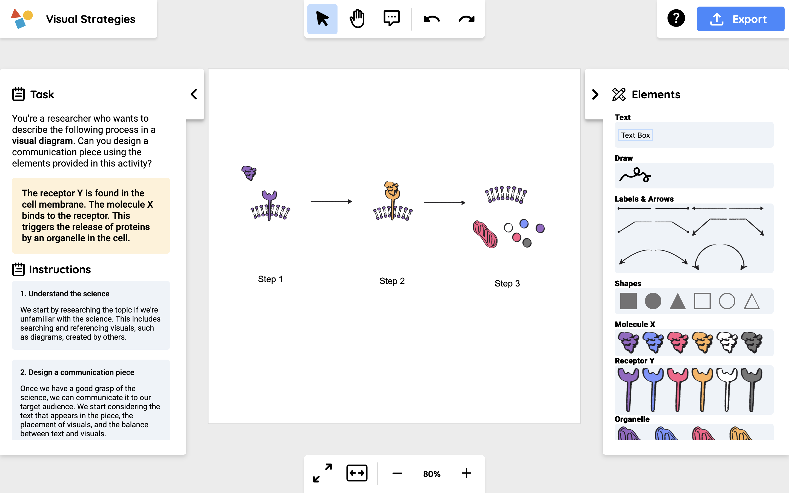

# Visual Science Communication Toolkit

This repository contains the interactive drag-and-drop activity of the Visual Science Communication Toolkit. The browser-based activity tasks students with designing a diagram depicting a hypothetical molecular process, utilizing a set of provided illustrations. At the end of the activity, students justify their design decisions using comment boxes placed over their diagram.

[Go to interactive activity.](https://visual-scicomm-toolkit.vercel.app/)

[Go to the complete Visual Science Communication Toolkit.](https://www.visabli.com/work/visual-scicomm-toolkit)

## Authors

The Visual Science Communication Toolkit was created by [VISABLI](https://www.visabli.com/) collaborators from the University of Toronto, University of California Davis, and Harvard University.

> Zhang KE, Jenkinson J. The Visual Science Communication Toolkit: Responding to the Need for Visual Science Communication Training in Undergraduate Life Sciences Education. _Education Sciences._ 2024; 14(3):296. https://doi.org/10.3390/educsci14030296.

###### Software development by Max Zhang.

## About

Visual representations are essential to scientific practice, playing a role in conceptual understanding, knowledge generation, and the communication of discovery and change. As scientists of tomorrow, undergraduate biology students need to develop the ability to create and interpret visual representations so they can make their thinking explicit when engaging with the scientific community.

We responded to the need for visual science communication training by creating a design activity for undergraduate students to apply and practice the principles of visual science communication. The application allows users to design a diagram using provided sets of images, shapes, lines, as well as tools for drawing and text. Progress is saved in the browser and users can download a snapshot of their design for sharing. The project is designed to be flexible and extensible, allowing for easy integration of new activities and features.

### Example

Using the elements provided in the activity, design a communication piece that describes the following process:

> The receptor Y is found in the cell membrane. The molecule X binds to the receptor. This triggers the release of proteins by an organelle in the cell.

## Developer Guide

The project is a client-side web app built with React and the Konva and react-tooltips libraries. See more in `developer-guide.md`.

To get started with the Visual Science Communication Toolkit:

1. Clone the repository
2. Install dependencies: `npm install`
3. Start the development server: `npm start`

### Making a New Activity

To create a new activity using the toolkit's basic whiteboard features, follow these steps:

1. Replace `src/activity.ts` with your new activity following the same schema.
2. Add your images, activity descriptions, and extra information to the `public/activity/` folder.
3. Run the toolkit, and your new activity will be available for selection.
